<!--
  ---------------------------------------------------------------------------
  Sir-Olexander / profile README
  ---------------------------------------------------------------------------
  Every panel below is a single  pointing at an SVG in .github/assets/.
  Those SVGs are generated by .github/scripts/generate.py — edit the IDENTITY,
  LANGS and PROJECTS blocks at the top of that file, then run:

      py .github/scripts/generate.py

  No workflows, no cron jobs, no external services required.
  ---------------------------------------------------------------------------
-->

<div align="center">





</div>

```js
console.log(weekend == true
  ? "Let me be, im taking a nap!"
  : "Hey o/ Ready for one more day of coding adventures?");
```

Agentic engineering by trade — and cross-platform apps with **Expo / React
Native** when something needs a face. Mostly TypeScript, mostly Supabase
underneath, mostly from a desk in Coimbra.

---

### Projects

<div align="center">



</div>

<!--
  These four are not public yet, so the cards are deliberately not linked.
  Once you push a repo, drop its link in here and the card becomes clickable:

  [Aura](https://github.com/Sir-Olexander/Aura) ·
  [Solus](https://github.com/Sir-Olexander/Solus) ·
  [Zyvo](https://github.com/Sir-Olexander/Zyvo) ·
  [Perkorsi](https://github.com/Sir-Olexander/Perkorsi)
-->

---

### Profile scan

<div align="center">



</div>

---

### The year, so far

<div align="center">



</div>

---

### Signal

<div align="center">



<br>


</div>

---

### Language stack

<div align="center">



</div>

<!--
  The panel above is self-declared (edit LANGS in generate.py). Once you have
  a few public repos, you can swap it for GitHub's own numbers:

  
-->

---

<div align="center">

<a href="https://github.com/Sir-Olexander">
  
</a>
<a href="https://www.linkedin.com/in/aubelos/">
  
</a>
<!-- Spare badges — uncomment and fill in when you want them:
<a href="https://YOUR-SITE.com">
  
</a>
<a href="mailto:YOUR@EMAIL.com">
  
</a>
-->

<br><br>

<sub>Every panel above is a single <code>&lt;img&gt;</code> tag — plain SVG, animated with SMIL.<br>
Regenerate them any time with <code>py .github/scripts/generate.py</code>.</sub>

</div>
